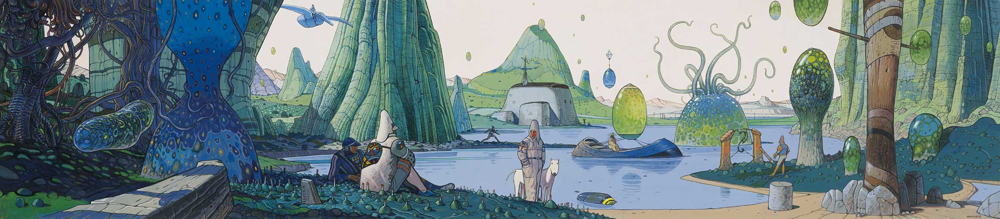

<!--- ------------------------------------------------------------------------------------------------------------------------------------------------------ -->
<!--- -- Visitor Badge + Links ----------------------------------------------------------------------------------------------------------------------------- -->
<!--- ------------------------------------------------------------------------------------------------------------------------------------------------------ -->

    <h1 align="center">
        
         
        
        
        
    </h1>

<h3 align="center">A curious student and a passionate data scientist from Barcelona. </h3>
 

> 💻 I'm currently working on my **Final Degree Project**
>
> 📚 I'm currently learning **Quantum Machine Learning**
> 
> 💬 Ask me about **Python, Data Science, or Classical music!**
> 
> 🕹️ About Me:
> - 🎓 I'm studying Data Science at UPC and currently at an Exchange Semester at KTH, Stockholm, where I'm taking advanced ML courses from the MSc in ML
> - 📡 I'm always interested in learning new things  
> - 🌿 I love hiking and diving  
> - 🎻 I've been playing the violin since 2010
> - 🎶 I'm part of the Coral Jove choir at the Sant Cugat Conservatory

  
<h2 align="center">🛠️ Tech Stack 🛠️</h2>
<!-- Programming Languages -->
<h3 align="center">Programming Languages

    

<!-- Tools -->
<h3 align="center">Tools

    

<!-- Workflow & Environment -->
<h3 align="center">Workflow & Environment

    

